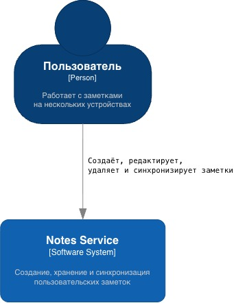
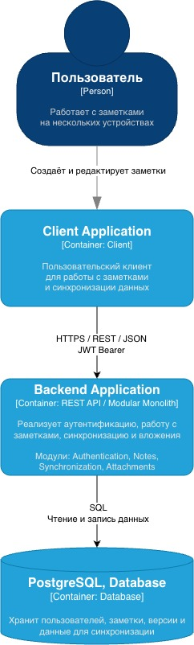
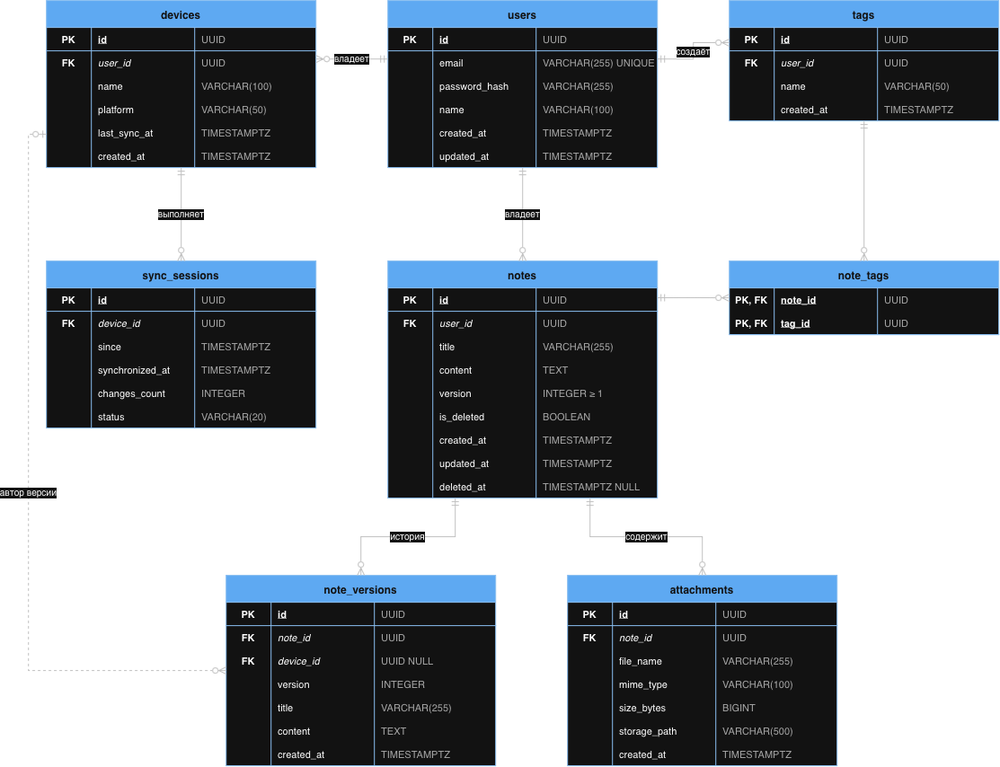

# Notes Service

## О проекте

Notes Service — клиент-серверная система для создания, хранения,
редактирования и синхронизации пользовательских заметок между несколькими
устройствами.

Проект разработан в рамках дисциплины «Создание клиент-серверных приложений»
и является продолжением архитектурного анализа приложений для работы
с заметками.

Основной целью проектирования является создание архитектуры, обеспечивающей
надёжное хранение пользовательских данных, согласованность состояния между
устройствами и формализованное взаимодействие клиентской и серверной частей.

## Основные возможности

Система предусматривает:

- регистрацию пользователей;
- аутентификацию пользователей;
- создание заметок;
- получение списка заметок;
- получение отдельной заметки;
- редактирование заметок;
- удаление заметок;
- синхронизацию изменений между устройствами;
- обнаружение конфликтов версий заметок.

## Архитектура

Для серверной части выбрана архитектура модульного монолита.

Система логически разделяется на следующие модули:

- Authentication — регистрация и аутентификация;
- Notes — управление заметками;
- Synchronization — синхронизация данных между устройствами;
- Attachments — работа с вложениями.

Клиентские приложения взаимодействуют с сервером посредством REST API.

Для хранения данных используется PostgreSQL.

Для доступа к защищённым ресурсам применяется JWT-аутентификация.

Подробное обоснование архитектурных решений приведено в:

`docs/architecture/ADR-001.md`

## API

Контракт REST API описан с использованием спецификации OpenAPI 3.0.

Основные endpoint:

| Метод | Endpoint | Назначение |
|---|---|---|
| POST | `/auth/register` | Регистрация пользователя |
| POST | `/auth/login` | Аутентификация пользователя |
| GET | `/notes` | Получение списка заметок |
| POST | `/notes` | Создание заметки |
| GET | `/notes/{noteId}` | Получение заметки |
| PATCH | `/notes/{noteId}` | Изменение заметки |
| DELETE | `/notes/{noteId}` | Удаление заметки |
| GET | `/sync` | Получение изменений для синхронизации |

Полная спецификация находится в:

`docs/architecture/openapi.yaml`

## Аутентификация

API использует Bearer Authentication на основе JWT.

После выполнения запроса:

`POST /auth/login`

сервер возвращает токен доступа.

Для обращения к защищённым endpoint клиент передаёт:

`Authorization: Bearer <token>`

## Синхронизация данных

Для поддержки работы пользователя на нескольких устройствах предусмотрен
механизм синхронизации.

Каждая заметка содержит номер версии. При изменении заметки клиент передаёт
текущую известную ему версию объекта.

Если сервер обнаруживает, что заметка уже была изменена другим клиентом,
изменение не применяется автоматически и клиент получает информацию
о конфликте.

Клиент также может запросить изменения, произошедшие после момента
последней успешной синхронизации.

## Архитектурная документация

В репозитории представлены следующие архитектурные артефакты:

1. ADR — описание и обоснование выбранных архитектурных решений;
2. C4 — диаграммы System Context и Container;
3. OpenAPI — формальный контракт REST API;
4. ER-диаграмма — модель данных системы.

## Структура репозитория

```
repo/
├── README.md
├── docs/
│   └── architecture/
│       ├── ADR-001.md
│       ├── c4-diagram.drawio
│       ├── c4-context.png
│       ├── c4-container.png
│       ├── openapi.yaml
│       ├── er-diagram.drawio
│       └── er-diagram.png
└── .gitignore
```

## Архитектурные артефакты

### ADR

`docs/architecture/ADR-001.md`

Содержит обоснование выбора модульного монолита, REST API, PostgreSQL,
JWT-аутентификации и механизма версионирования данных.

### C4

`docs/architecture/c4-diagram.drawio`

Содержит диаграммы System Context и Container.





### OpenAPI

`docs/architecture/openapi.yaml`

Содержит описание REST API системы, схем данных, параметров запросов,
ответов и механизма аутентификации.

### ER-диаграмма

`docs/architecture/er-diagram.png` (исходник — `docs/architecture/er-diagram.drawio`)

Отображает основные сущности системы и связи между ними.


